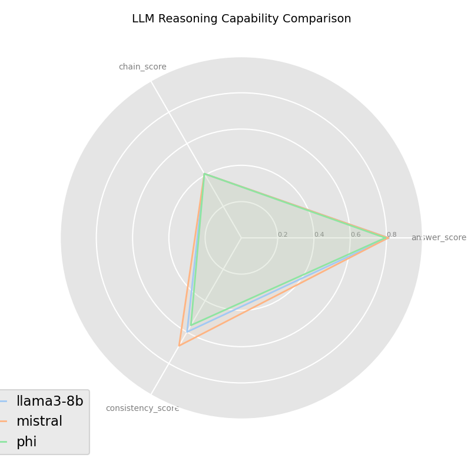
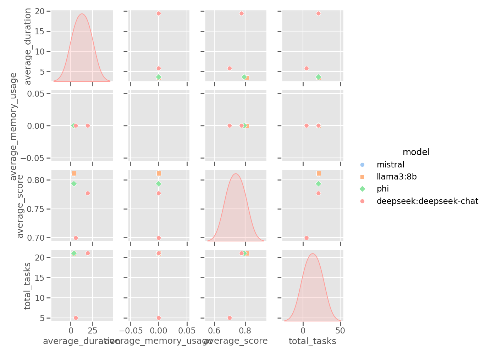
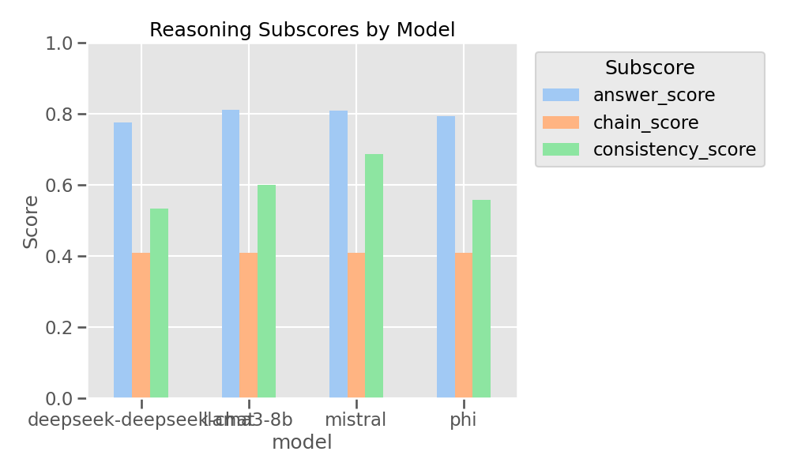

# 🧠 LLMBenchMark

This project benchmarks local Large Language Models (LLMs) on tasks such as **question answering**, **code generation**, **logical reasoning**, and **summarization**. It provides **structured evaluation results**, rich **visualizations**, and a detailed **markdown report**.

---

## 🚀 Installation and Environment Setup

### 1. Clone the project
```bash
git clone https://github.com/LuckyJH2024/LLMBenchMark.git your_file_name
cd your_file_name
```

### 2. Create and activate a virtual environment (optional)
```bash
python -m venv venv
source venv/bin/activate        # Windows: venv\Scripts\activate
```

### 3. Install dependencies
```bash
pip install -r requirements.txt
```

---

## 🧩 Start Ollama and Load Models

### 4. Start Ollama
Ensure [Ollama](https://ollama.com/) is installed and running:
```bash
ollama serve
```

### 5. Pull required models
```bash
ollama run phi
ollama run mistral
ollama run llama3:8b
```

To check available models:
```bash
ollama list
```

---

## 🧪 Run the Benchmark

### 6. Execute the main script
```bash
python main.py
```

This will:
- Run all task benchmarks
- Evaluate your selected models
- Generate outputs in `results/`:
  - `.json` results
  - Radar / bar / heatmap plots
  - Markdown summary report

---

## 📚 Task Datasets

| Task Type      | File Name                  | Description                     |
|----------------|----------------------------|---------------------------------|
| QA             | `qa_benchmark.json`        | Question answering              |
| Code           | `code_benchmark.json`      | Code completion & generation    |
| Reasoning      | `sample_reasoning_eval.json` | Multi-type logical reasoning    |
| Summarization  | `summarization_benchmark.json` | Text summarization tasks    |

Modify or extend any dataset to suit your testing needs.

---

## 📊 View Results

- Markdown reports: `results/benchmark_report_*.md`
- Charts: `results/*.png`
- Viewable in VSCode, Typora, or any markdown/image viewer

---

## 💻 Supported Models

You can use any model supported by Ollama, including:

- `phi`
- `mistral`
- `llama3:8b`

Update the model list in `main.py` to benchmark others.

---

## 🧱 Project Structure

```
├── main.py                 # Entry point
├── benchmark.py            # Core logic & evaluation
├── tasks.py                # Load and format task data
├── visualization.py        # Create plots & dashboards
├── report.py               # Markdown report generation
├── requirements.txt
├── data/*.json             # Task definitions
└── results/                # Output results and visualizations
```

---

# 🧠 Reasoning Benchmark Overview

### 🧩 File:
```
data/sample_reasoning_eval.json
```

### 🧪 Structure:
```json
{
  "context": "...",
  "question": "...",
  "response": "...",
  "ground_truth": "...",
  "reasoning_steps": [...],
  "reference_steps": [...],
  "paraphrased_response": "..."
}
```

### 🔍 Covered Reasoning Types

| Type                       | Description                                 | #
|---------------------------|---------------------------------------------|----|
| Multi-hop Reasoning       | Chain of facts (e.g., A > B > C)             | 3  |
| Syllogistic Reasoning     | Classic logic from category relationships   | 3  |
| Causal Reasoning          | Fallacy avoidance, cause-effect logic       | 3  |
| Numerical / Symbolic      | Basic arithmetic, quantities, logic math    | 3  |
| Boolean Reasoning         | Truth, contradiction, set membership        | 3  |
| Counterfactual Reasoning  | What-if reasoning                           | 3  |
| Planning / Procedural     | Goal-driven task planning                   | 3  |

---

### ⚙️ Evaluation Metrics

Each sample is automatically scored across:

| Metric             | Meaning                                              |
|--------------------|------------------------------------------------------|
| `answer_score`     | Response vs. ground truth (BERTScore / SBERT)       |
| `chain_score`      | Reasoning steps vs. reference reasoning             |
| `consistency_score`| Paraphrased response consistency                    |
| `score`            | Final weighted score (used in radar/visuals)        |

---

## 🔬 Three Evaluation Directions

### 1. ✅ Answer Accuracy Only
Evaluate whether the model gave the **correct final answer**.

- Compare `response` vs `ground_truth`
- Use BERTScore / SBERT
- Metric: `answer_score`

### 2. 🔗 Reasoning Process Matching
Compare **step-by-step** logic to `reference_steps`.

- Use `reasoning_steps` and `reference_steps`
- Metric: `chain_score` via average semantic match

### 3. ♻️ Paraphrase Consistency
Check **robustness** against paraphrasing.

- Compare `response` and `paraphrased_response`
- Metric: `consistency_score`

---

## 📌 Example Prompt Format

```
Context: All mammals are warm-blooded. Whales are mammals.
Question: Are whales warm-blooded?
Answer:
```

Expected output:
> Yes, because whales are mammals and all mammals are warm-blooded.

---

## 📤 Extend the Benchmark

- Add new examples to `sample_reasoning_eval.json`
- Keep same field structure, append `"type"` as needed
- You may add adversarial variants for robustness testing

---

## 📈 Outputs and Visuals

- `results/{model}_reasoning.json`: Per-model scores
- `radar_chart.png`: 3-score profile per model
  
- `performance_dashboard.png`: Model × task comparison
  
- `reasoning_bar_comparison.png`: Comparison of reasoning subscores (answer, chain, consistency) across models  
  


