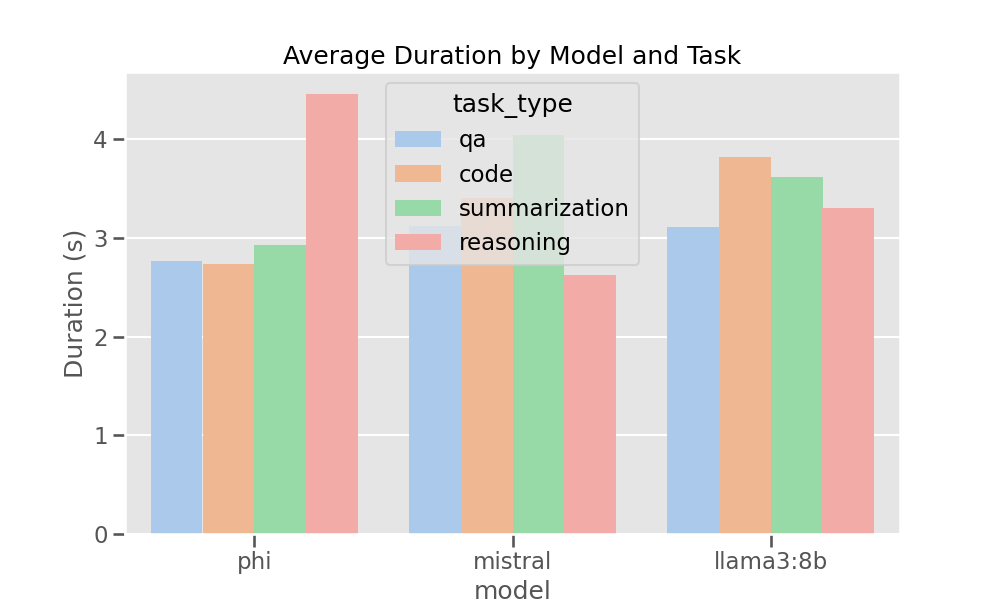

# LLMBenchMark

This project benchmarks local LLMs (Large Language Models) on tasks such as question answering, code generation, reasoning, and summarization. It produces structured evaluation results with visualizations and markdown reports.

---

## Installation and Environment Setup

### 1. Clone the project and navigate to the directory
```bash
git clone https://github.com/LuckyJH2024/LLMBenchMark.git your_file_name
```

### 2. Create and activate a virtual environment (optional)
```bash
python3 -m venv venv
source venv/bin/activate  # For Windows: venv\Scripts\activate
```

### 3. Install dependencies
```bash
pip install -r requirements.txt
```

---

## Start Ollama and Load Models

### 4. Start Ollama (Local inference service)
Make sure [Ollama](https://ollama.com/) is installed and running:
```bash
ollama serve
```

### 5. Pull required models (first-time only)
```bash
ollama run phi
ollama run mistral
ollama run llama3:8b
```
If you want to see all models downloaded on your machine, use this in your terminal (outside the prompt):
```bash
ollama list
```
The one you ran most recently is typically the one you're interacting with unless you switched.

---

## Run the Benchmark

### 6. Execute the main script
```bash
python main.py
```

This will run benchmarks and generate outputs in the `results/` directory:

- JSON results per model-task combination (e.g. `phi_qa.json`)
- Visualizations:
  - `average_duration.png`
  - `average_memory_usage.png`
  - `performance_dashboard.png`
- Summary Markdown Report:
  - e.g. `benchmark_report_20250412_211738.md`

---

## Task Datasets

The following input files are used for benchmarking tasks:

- `qa_benchmark.json` – Question answering
- `code_benchmark.json` – Code generation
- `reasoning_benchmark.json` – Logical reasoning
- `summarization_benchmark.json` – Text summarization

You can modify these JSON files to add your own benchmark tasks.

---

## View Results

- Markdown reports can be viewed with VSCode, Typora, or any markdown viewer.
- PNG charts provide visual summaries of model performance.

---

## Supported Models

Ollama-compatible local models, such as:

- `phi`
- `mistral`
- `llama3:8b`

To add other models, modify the model list in `main.py`.

---

## Project Structure

```
├── main.py                 # Entry point
├── benchmark.py           # Core logic: model calls, metrics, runtime
├── tasks.py               # Task loading functions
├── visualization.py       # Plotting performance
├── report.py              # Markdown report generation
├── requirements.txt
├── *.json                 # Task input data
└── results/               # All benchmark outputs
```

---

## Example Output

You will see results like the following chart:



---

For further assistance, explore the source code and in-line documentation. Contributions welcome!

