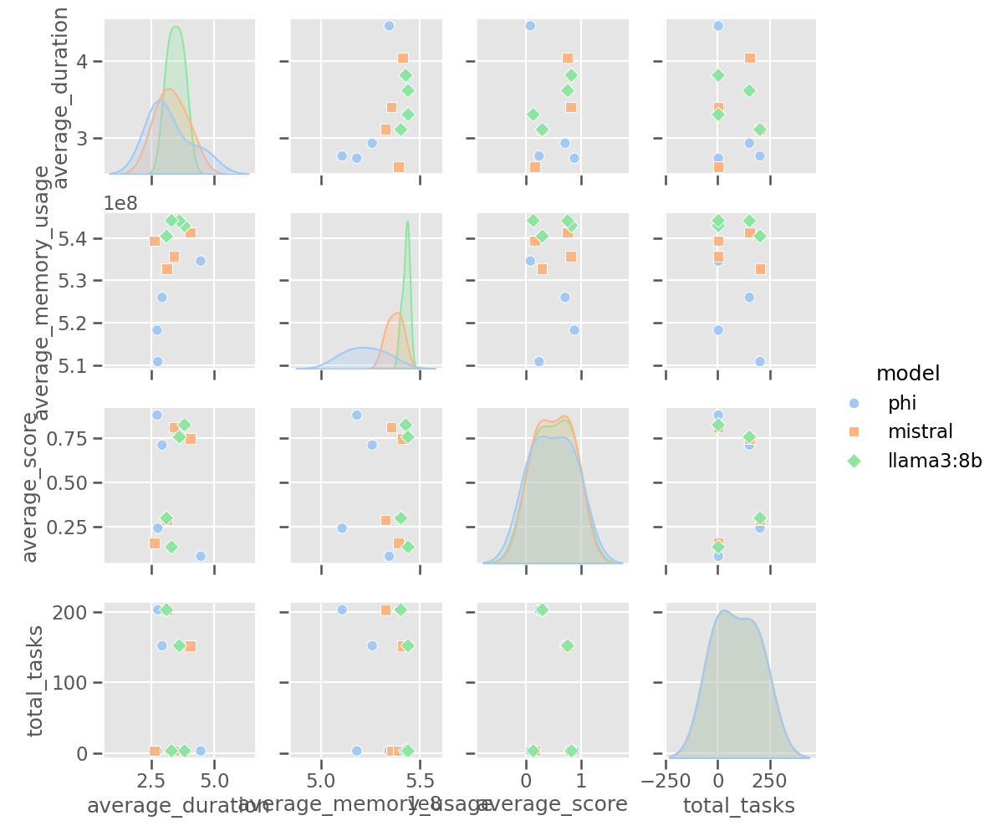

# 🧠 LLMBenchMark

This project benchmarks local Large Language Models (LLMs) on tasks such as **question answering**, **code generation**, **logical reasoning**, and **summarization**. It provides **structured evaluation results**, rich **visualizations**, and a detailed **markdown report**.

---

## 🚀 Installation and Environment Setup

### 1. Clone the project
```bash
git clone https://github.com/LuckyJH2024/LLMBenchMark.git your_file_name
cd your_file_name
```

### 2. Create and activate a virtual environment (optional)
```bash
python -m venv venv
source venv/bin/activate        # Windows: venv\Scripts\activate
```

### 3. Install dependencies
```bash
pip install -r requirements.txt
```

---

## 🧩 Start Ollama and Load Models

### 4. Start Ollama
Ensure [Ollama](https://ollama.com/) is installed and running:
```bash
ollama serve
```

### 5. Pull required models
```bash
ollama run phi
ollama run mistral
ollama run llama3:8b
```

To check available models:
```bash
ollama list
```

---

## 🧪 Run the Benchmark

### 6. Execute the main script
```bash
python main.py
```

This will:
- Run all task benchmarks
- Evaluate your selected models
- Generate outputs in `results/`:
  - `.json` results
  - Radar / bar / heatmap plots
  - Markdown summary report

---

## 📚 Task Datasets

| Task Type      | File Name                  | Description                     |
|----------------|----------------------------|---------------------------------|
| QA             | `qa_benchmark.json`        | Question answering              |
| Code           | `code_benchmark.json`      | Code completion & generation    |
| Reasoning      | `sample_reasoning_eval.json` | Multi-type logical reasoning    |
| Summarization  | `summarization_benchmark.json` | Text summarization tasks    |

Modify or extend any dataset to suit your testing needs.

---

## 📊 View Results

- Markdown reports: `results/benchmark_report_*.md`
- Charts: `results/*.png`
- Viewable in VSCode, Typora, or any markdown/image viewer

---

## 💻 Supported Models

You can use any model supported by Ollama, including:

- `phi`
- `mistral`
- `llama3:8b`

Update the model list in `main.py` to benchmark others.

---

## 🌐 Using Cloud API Models (NEW!)

In addition to local Ollama models, you can now benchmark cloud-based API models from:

- OpenAI (GPT-3.5, GPT-4)
- DeepSeek
- Anthropic (Claude)

### Setup API Keys

Set environment variables for the providers you want to use:

```bash
export OPENAI_API_KEY="your_openai_key"
export DEEPSEEK_API_KEY="your_deepseek_key"
export ANTHROPIC_API_KEY="your_anthropic_key"
```

### Run API benchmarks

```bash
python run_api_benchmark.py --models openai:gpt-4 anthropic:claude-3-sonnet
```

Additional options:
```bash
# Run specific task types
python run_api_benchmark.py --models openai:gpt-4 --task-types qa reasoning

# Change output directory
python run_api_benchmark.py --models deepseek:deepseek-chat --results-dir api_results
```

Results will be saved to the specified directory, with reports and visualizations similar to local model benchmarks.

---

## 🧱 Project Structure

```
├── main.py                 # Entry point
├── run_api_benchmark.py    # API models benchmark script
├── benchmark_framework/
│   ├── benchmark.py        # Core logic & evaluation
│   ├── api_models.py       # API model integration
│   ├── tasks.py            # Load and format task data
│   ├── visualization.py    # Create plots & dashboards
│   └── report.py           # Markdown report generation
├── requirements.txt
├── data/*.json             # Task definitions
└── results/                # Output results and visualizations
```

---

# 🧠 Reasoning Benchmark Overview

### 🧩 File:
```
data/sample_reasoning_eval.json
```

### 🧪 Structure:
```json
{
  "context": "...",
  "question": "...",
  "response": "...",
  "ground_truth": "...",
  "reasoning_steps": [...],
  "reference_steps": [...],
  "paraphrased_response": "..."
}
```

### 🔍 Covered Reasoning Types

| Type                       | Description                                 | #
|---------------------------|---------------------------------------------|----|
| Multi-hop Reasoning       | Chain of facts (e.g., A > B > C)             | 3  |
| Syllogistic Reasoning     | Classic logic from category relationships   | 3  |
| Causal Reasoning          | Fallacy avoidance, cause-effect logic       | 3  |
| Numerical / Symbolic      | Basic arithmetic, quantities, logic math    | 3  |
| Boolean Reasoning         | Truth, contradiction, set membership        | 3  |
| Counterfactual Reasoning  | What-if reasoning                           | 3  |
| Planning / Procedural     | Goal-driven task planning                   | 3  |

---

### ⚙️ Evaluation Metrics

Each sample is automatically scored across:

| Metric             | Meaning                                              |
|--------------------|------------------------------------------------------|
| `answer_score`     | Response vs. ground truth (BERTScore / SBERT)       |
| `chain_score`      | Reasoning steps vs. reference reasoning             |
| `consistency_score`| Paraphrased response consistency                    |
| `score`            | Final weighted score (used in radar/visuals)        |

---

## 🔬 Three Evaluation Directions

### 1. ✅ Answer Accuracy Only
Evaluate whether the model gave the **correct final answer**.

- Compare `response` vs `ground_truth`
- Use BERTScore / SBERT
- Metric: `answer_score`

### 2. 🔗 Reasoning Process Matching
Compare **step-by-step** logic to `reference_steps`.

- Use `reasoning_steps` and `reference_steps`
- Metric: `chain_score` via average semantic match

### 3. ♻️ Paraphrase Consistency
Check **robustness** against paraphrasing.

- Compare `response` and `paraphrased_response`
- Metric: `consistency_score`

---

## 📌 Example Prompt Format

```
Context: All mammals are warm-blooded. Whales are mammals.
Question: Are whales warm-blooded?
Answer:
```

Expected output:
> Yes, because whales are mammals and all mammals are warm-blooded.

---

## 📤 Extend the Benchmark

- Add new examples to `sample_reasoning_eval.json`
- Keep same field structure, append `"type"` as needed
- You may add adversarial variants for robustness testing

---

## 📈 Outputs and Visuals

- `results/{model}_reasoning.json`: Per-model scores
- `radar_chart.png`: 3-score profile per model
  
- `performance_dashboard.png`: Model × task comparison
  
- `reasoning_bar_comparison.png`: Comparison of reasoning subscores (answer, chain, consistency) across models  
  

# 大语言模型基准测试框架

这个项目是一个用于评估大型语言模型（LLM）API性能的基准测试框架。它支持多种类型的评估，包括推理能力、代码生成以及基于APPS数据集的编程题解决能力测试。

## 功能特点

- 支持OpenAI、Anthropic、Google、Baidu、Zhipu等多种API模型
- 内置多种评估任务：推理评估、编码能力测试、APPS编程题目测试
- 自动生成详细的性能评估报告和可视化结果
- 支持并行处理以提高测试效率
- 模块化设计，便于扩展和定制

## 安装与配置

### 1. 安装依赖

```bash
pip install -r requirements.txt
```

### 2. API密钥配置

系统支持多种API提供商，您需要在`config.json`文件中配置对应的API密钥：

```json
{
    "api_keys": {
        "openai": {
            "api_key": "YOUR_OPENAI_API_KEY"
        },
        "anthropic": {
            "api_key": "YOUR_ANTHROPIC_API_KEY"
        },
        "google": {
            "api_key": "YOUR_GOOGLE_API_KEY"
        },
        "baidu": {
            "api_key": "YOUR_BAIDU_API_KEY",
            "secret_key": "YOUR_BAIDU_SECRET_KEY"
        },
        "zhipu": {
            "api_key": "YOUR_ZHIPU_API_KEY"
        }
    },
    "api_base": {
        "openai": "https://api.openai.com/v1",
        "anthropic": "https://api.anthropic.com",
        "google": "https://generativelanguage.googleapis.com/v1",
        "baidu": "https://aip.baidubce.com/rpc/2.0/ai_custom/v1/wenxinworkshop",
        "zhipu": "https://open.bigmodel.cn/api/paas"
    }
}
```

对于需要使用AWS Bedrock的Anthropic Claude模型，配置如下：

```json
{
    "api_keys": {
        "anthropic_bedrock": {
            "aws_access_key": "YOUR_AWS_ACCESS_KEY",
            "aws_secret_key": "YOUR_AWS_SECRET_KEY",
            "aws_region": "us-west-2"
        }
    }
}
```

对于需要使用Google Vertex AI的Claude模型，配置如下：

```json
{
    "api_keys": {
        "anthropic_vertex": {
            "project_id": "YOUR_GCP_PROJECT_ID",
            "region": "us-central1"
        }
    }
}
```

您可以运行以下命令来设置配置文件：

```bash
python setup_config.py
```

这个脚本会引导您输入各个平台的API密钥，并自动创建或更新配置文件。

## 运行评估

### 1. 运行推理能力评估

```bash
python run_api_benchmark.py --models openai:gpt-4 anthropic:claude-3-5-sonnet-20240620 --tasks reasoning
```

### 2. 运行编码能力评估

```bash
python run_api_benchmark.py --models openai:gpt-4 anthropic:claude-3-5-sonnet-20240620 --tasks coding
```

### 3. 运行APPS编程题评估

```bash
python apps_benchmark.py --models openai:gpt-4 anthropic:claude-3-5-sonnet-20240620 --difficulties interview competition --problems 5
```

## 生成可视化结果

评估结果会自动保存到`results`目录。您可以生成更详细的可视化：

```bash
python generate_heatmap.py
```

## 支持的模型

当前支持的模型包括：

| 提供商 | 模型ID格式 | 示例 |
|--------|------------|------|
| OpenAI | openai:模型名 | openai:gpt-4 |
| Anthropic | anthropic:模型名 | anthropic:claude-3-5-sonnet-20240620 |
| Anthropic (Bedrock) | anthropic_bedrock:模型名 | anthropic_bedrock:anthropic.claude-3-5-sonnet-20240620-v1:0 |
| Anthropic (Vertex) | anthropic_vertex:模型名 | anthropic_vertex:claude-3-5-sonnet@20240620 |
| Google | google:模型名 | google:gemini-pro |
| Baidu | baidu:模型名 | baidu:ernie-4.0 |
| Zhipu | zhipu:模型名 | zhipu:glm-4 |

## 设置脚本使用说明

`setup_config.py`是一个交互式脚本，可帮助您设置API密钥：

```bash
python setup_config.py
```

执行后，脚本会：

1. 检查是否存在现有的配置文件
2. 引导您选择要配置的API提供商
3. 根据选择的提供商，提示输入相应的API密钥和其他必要信息
4. 更新或创建配置文件

示例：

```
选择要配置的API提供商:
1. OpenAI
2. Anthropic
3. Anthropic (Bedrock)
4. Anthropic (Vertex)
5. Google
6. Baidu
7. Zhipu
8. 全部配置
9. 退出

请输入选项(1-9): 2
请输入Anthropic API密钥: sk-ant-xxxxx
Anthropic API密钥已保存!
```

## 注意事项

- 部分API提供商可能需要科学上网才能访问
- 请确保您的API密钥有足够的额度来完成测试
- 建议使用虚拟环境来避免依赖冲突
- APPS数据集测试需要下载并将数据集放在项目根目录下的`APPS`文件夹中